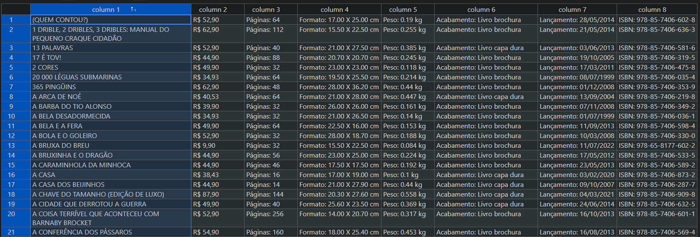

# Scraping BeautifulSoup Example

Projeto criado pra fins didaticos.
É realizado uma raspagem de dados do site https://www.companhiadasletras.com.br, para que seja retornado informações de livros e precificação do site onde tudo é salvo em um arquivo .csv



##### Requiriments

```python  beautifulsoup4==4.12.2
certifi==2023.5.7
charset-normalizer==3.1.0
idna==3.4
lxml==4.9.2
requests==2.31.0
soupsieve==2.4.1
urllib3==2.0.2
```
